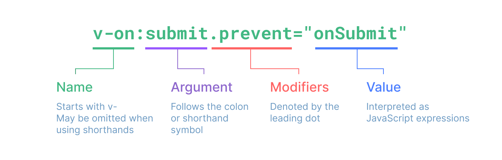

# VUE

## Introduction
>Cos è Vue?

Vue è un framework JavaScript per la creazione di interfacce utente dinamiche e reattive, basato su HTML, CSS e JS.

Una delle principali caratteristiche di Vue è il suo utilizzo per la creazione di **Single-Page Applications**, ovvero un'applicazione web che si **aggiorna automaticamente** al cambiare/aggiornamento di elementi in JS senza nessun ricaricamento manuale della pagina.

>API

I componenti Vue possono essere scritti in **due** diversi stili di API (**A**pplication **P**rogramming **I**nterface)

**Options API**

I componenti vengono raggruppati in 3 "opzioni" 

- `data`
    - data restituisce (return) un oggetto con delle key
    
        (da DOC: become reactive state and will be exposed on 'this') 
- `methods`
    - I metodi sono **funzioni** che modificano lo stato degli aggiornamenti (modificare la value delle key in data)
- `mounted` <-- (da approfondire)

**Composition API** <--(da approfondire)

## Template Syntax 

>TEXT INTERPOLATION

**Sintassi "Mustache" o "Baffo" (doppie parentesi graffe)** 

`Messaggio: {{ msg }}`

Il tag verrà sostituito con il valore della proprietà `msg` dall'istanza del componente corrispondente (all'interno di `data()`). Sarà anche aggiornato ogni volta che la proprietà msg cambia.

>DIRETTIVE

Le direttive sono attributi speciali con il prefisso `v-`.

Il compito di una direttiva è applicare reattivamente gli aggiornamenti al DOM quando il valore della sua espressione cambia.

- **v-bind : Associazioni di Attributi (binding)**

Le parentesi graffe non possono essere utilizzate all'interno dei tag HTML. Si può usare, invece, la direttiva `v-bind`:

`

`

`dynamicId` è una proprietà in `data()`, se essa cambia, cambierà anche qui. Se il valore associato è `null` o `undefined`, l'attributo verrà rimosso dall'elemento. 

abbreviazione : `

` --> senza `v-bind`

- **v-html : HTML PURO**

Le doppie parentesi graffe interpretano i dati come testo normale, non HTML. Per produrre vero HTML, avrò bisogno di utilizzare la direttiva `v-html`

- **Attributi Booleani**

Gli Attributi Booleani sono attributi che possono indicare valori `true`/ `false` su un elemento. Ad esempio, `disabled` è uno degli attributi booleani più comunemente utilizzati.

`<button :disabled="isButtonDisabled">Button</button>`

`:disabled` è un valore **truthy** : valore che è **true** di base in un contesto booleano a meno che non lo si dichiari **false** (tutti i valori sono truthy tranne: `false`, `0`, `-0`, `0n`, `""`, `null`, `undefined`, `NaN`, e `document.all`)

- **v-if**

`
Ora mi vedi
`

Qui, la direttiva v-if può rimuovere/inserire l'elemento `
` in base alla veridicità del valore dell'espressione `seen`.

- **v-on Event Listener**

`<a v-on:click="doSomething"> ... </a>`

abbreviato:

`<a @click="doSomething"> ... </a>`

**ARGUMENTS**

Alcune direttive possono accettare un "argomento", indicato da due punti dopo il nome della direttiva.

`<a v-bind:href="url"> ... </a>`

Qui `href` è l'argomento, che indica alla direttiva `v-bind` di collegare l'attributo `href` dell'elemento al valore dell'espressione `url`

**Argomenti Dinamici** 

È possibile utilizzare anche un'espressione JavaScript come argomento di direttiva, racchiudendola tra parentesi quadre:

`<a v-bind:[attributeName]="url"> ... </a>`

`<a v-on:[eventName]="doSomething"> ... </a>`

Qui `attributeName` e `eventName` saranno come un'espressione JavaScript e il loro valore generato verrà utilizzato come valore finale per l'argomento.

Quindi se ad esempio `attributeName: href` e `eventName: click`

allora avrò: 

`<a v-bind:href="url"> ... </a>`

`<a v-on:click="doSomething"> ... </a>`

**MODIFIERS** <--(da approfondire) 

schema:

